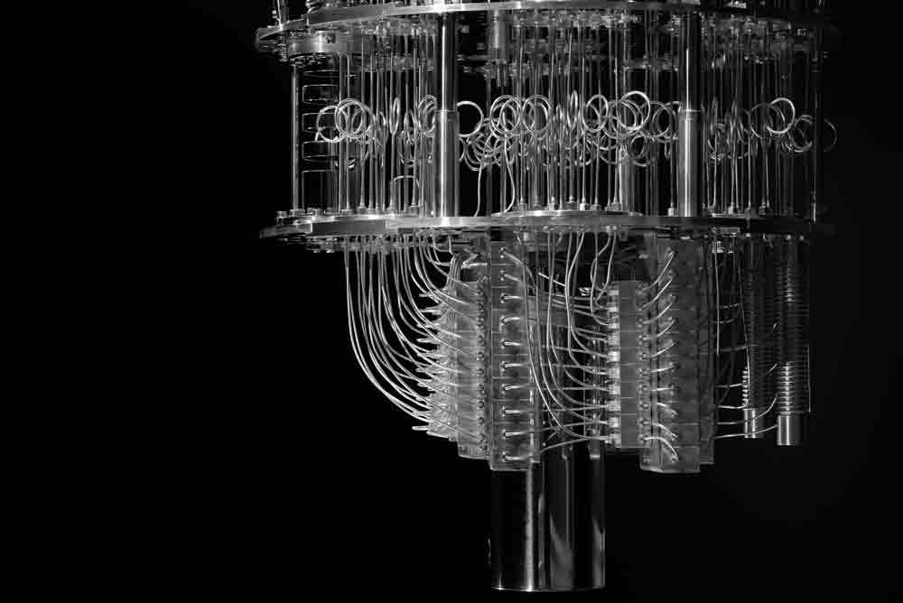

:::: {.columns}

::: {.column width="65%"}
## Welcome

I really like to see how computers can helps us to improve our understanding of the world

Principally I work with **Python**, **Pandas**, y **Tensor Flow**.

Here you will find some materials from lectures I have given, personal projects and learnings.

If you have and doubt, feel free to send me an email. 

[See my projects](proyectos.qmd){.btn .btn-primary}
[About me](about.qmd){.btn .btn-outline-secondary}
:::

::: {.column width="35%"}
{width=1000px style="border-radius: 5%; box-shadow: 0 4px 16px rgba(0,0,0,0.15);"}

:::

::::

---

## Habilities

::: {.grid}

::: {.g-col-4}
### Python
Pandas, NumPy, Scikit-learn, Tensor Flow, Qskit
:::

::: {.g-col-4}
### Visualization
Plotly, Matplotlib, Seaborn
:::

::: {.g-col-4}
### Publicación
Quarto, GitHub Pages
:::

::::

---

## Topics Covered

::: {.g-col-4}
Modern Physics, Quantum Mechanics, Quantum Computing, Machine Learning, Deep Learning, Control Systems, Linear Algebra, Numerical Analysis. 
:::